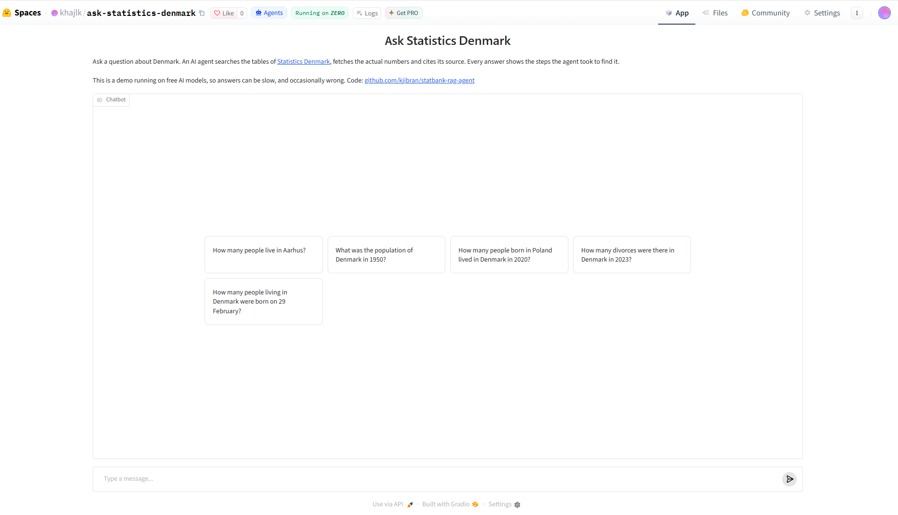
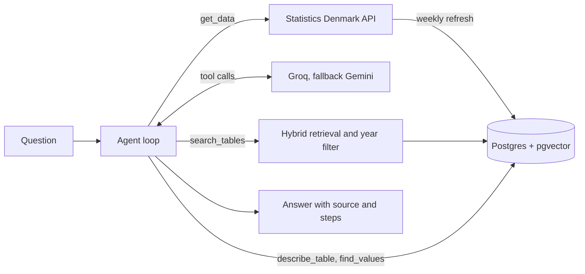

# Ask Statistics Denmark

An AI agent that answers questions about Denmark with official numbers from [Statistics Denmark](https://www.statbank.dk). It finds the right table among about 2,300, looks up the codes it needs, fetches the actual data and cites its source. Every answer shows the steps the agent took.

**Try it:** [huggingface.co/spaces/khajlk/ask-statistics-denmark](https://huggingface.co/spaces/khajlk/ask-statistics-denmark)
**Experiments:** [MLflow on DagsHub](https://dagshub.com/kjibran/statbank-rag-agent/experiments)



```
Question: How many people lived in Aarhus municipality on 1 January 2020?

1. search_tables("population")
2. describe_table("PAAROE03")
3. find_values("PAAROE03", "HOVEDBOPÆL", "Aarhus")  ->  751=Aarhus
4. get_data("PAAROE03", {"HOVEDBOPÆL": ["751"], "Tid": ["2020"]})

349 983 people lived in Aarhus municipality on 1 January 2020.
Source: Statistics Denmark, StatBank.dk/paaroe03
```

## What it does

Statistics Denmark publishes thousands of tables through an open API. Finding the right one is hard: many tables share the same title, variables have Danish codes, and the same number can sit in several tables with different definitions. This project solves that in two parts:

1. **Retrieval:** a searchable catalogue of all tables, with hybrid search (BM25 keyword search plus vector embeddings) and a year filter. Every change to the search was measured on a labelled test set.
2. **An agent:** a language model that uses four tools to search the catalogue, inspect a table, look up codes and fetch data. It may only state numbers it actually fetched. The agent is evaluated on questions with known correct answers.



## The data

The catalogue is built from the Statbank API: the list of tables, then the full metadata of every table (variables and all their values). Findings that shaped the design:

- **Titles do not identify tables.** 2,309 tables shared only 1,506 distinct titles. Five different tables are all called "Population 1. January".
- **Variable codes are Danish** even in the English API (OMRÅDE for region, KØN for sex), and values have codes (Copenhagen is 101, quarters are written 2008K1).
- **Data comes as semicolon-separated CSV with a byte-order mark**, and the number column is called INDHOLD.
- **Variables left out of a request are summed.** That is useful, but only safe when the values cover everything. A table broken down by islands sums only the listed islands, not all of Denmark.

Each table gets a search text with its title, time range, unit, publishing frequency and up to 12 value labels per variable. The value labels carry the words people search with ("retail", "Poland", "divorce") and separate tables with identical titles: identical search texts dropped from 39 to a single pair. The frequency is read from the period format (2021M10 means monthly), and monthly tables also list the month names, so a question about "1 March" can find them.

Embeddings use `BAAI/bge-small-en-v1.5` through fastembed (384 dimensions, CPU only) and are stored in Postgres with pgvector and an HNSW index.

## Retrieval: measured step by step

**Test set:** 48 questions. 40 were written for a fair sample of tables (one per topic prefix, in a fixed pseudo-random order) and phrased the way a person would ask, avoiding the title's words. 8 target known hard cases: place names, years, value labels and monthly data. Each question lists every table that would answer it.

Labels were corrected with evidence, never to raise a score. Where the search returned a table not in the labels, its variables and time range were checked. Domestic bank deposits in DNPINDK were added as a valid answer. KAS311 ("average number of employed") was rejected for a question about people on the payroll, because "employed" includes the self-employed.

**Metrics:** hit@k is the share of questions with a correct table in the top k. MRR rewards ranking a correct table near the top.

| Step | Method | hit@1 | hit@5 | hit@10 | MRR |
|---|---|---|---|---|---|
| 1 | Vector search | 0.19 | 0.62 | 0.73 | 0.35 |
| 2 | Keyword search, Postgres ranking | 0.06 | 0.23 | 0.33 | 0.13 |
| 2 | Hybrid with Postgres ranking | 0.19 | 0.46 | 0.65 | 0.31 |
| 3 | Keyword search, BM25 | 0.23 | 0.48 | 0.58 | 0.35 |
| 3 | Hybrid with BM25 | 0.27 | 0.56 | 0.71 | 0.39 |
| 4* | Vector, year pre-filter | 0.23 | 0.67 | 0.75 | 0.39 |
| 4* | Hybrid, year pre-filter | 0.29 | 0.60 | 0.75 | 0.42 |
| 5* | Hybrid, year pre-filter, frequency in search text | 0.25 | 0.65 | 0.71 | 0.39 |

\* After one label correction: the 1950 population question also accepts the census table FT and a historical population table, which both cover 1950. Every MLflow run records a fingerprint of the test file, so runs on different labels are never compared by mistake.

What the numbers taught:

- **Hybrid search is not automatically better.** With Postgres's built-in ranking, adding keyword search made results worse (hit@5 from 0.62 to 0.46).
- **The cause was ranking without word rarity.** Postgres ranks a match on "number" as highly as a match on "milk", but "number" appears in most tables. BM25 weighs rare words more. Implemented in about 40 lines of Python, it doubled keyword search.
- **Years need a filter, not better embeddings.** Neither embeddings nor keywords know that "1950" rules out a table starting in 2008. Filtering on each table's time range solved both year questions. Filtering inside the query (pre-filtering) is used rather than after it, since post-filtering cannot recover a table that was not among the first 50 candidates.
- **Adding the frequency fixed a real failure at little cost.** Hybrid hit@5 rose and the other metrics dipped by one or two questions, within the noise of a 48-question set.

The agent uses hybrid search with the year pre-filter. It looks at the top 8 candidates and inspects them before choosing, so finding a correct table among the top results matters more than ranking it first.

## The agent

The model gets four tools:

| Tool | Purpose |
|---|---|
| `search_tables(query)` | Candidate tables for a topic, one compact line each |
| `describe_table(table_id)` | Variables, example codes, time codes and a warning when leaving a variable out may not cover everything |
| `find_values(table_id, variable, text)` | Codes for a place, category or age. "Århus" finds Aarhus |
| `get_data(table_id, selections)` | The numbers, after checking codes, required variables and size (at most 200 numbers) |

Design choices:

- **The agent writes its own search query.** It searches for "population", not "How many people live in Aarhus?", and finds Aarhus later with `find_values`.
- **Tools never crash.** Problems come back as messages such as "Variable Tid (time) must be selected", and the agent corrects itself on the next step.
- **Answers come only from fetched data**, with a source line in the format Statistics Denmark asks for. When the agent finds nothing, it says it could not find a table, never that the data does not exist.
- **No loops.** An identical repeated tool call is blocked and the agent is told to try another table or other words.
- **At most 8 steps.** At the limit, the model gets its results as plain prose and must answer or say it could not find the data. If even that fails, the agent answers honestly by itself instead of crashing.
- **One provider per question.** Groq is tried first, then Gemini. A tool-calling conversation cannot move between providers halfway: Gemini rejected a conversation whose earlier tool calls came from Groq, because it requires its own signature on each tool call. If a provider fails for good, the question restarts from scratch with the next one.
- **Rate limits and overloads are retried** after the wait the provider asks for.
- **Compact tool results and low reasoning effort** on Groq cut tokens per question by about a quarter.

## Agent evaluation

**Test set:** 15 questions with one correct number each, all about fixed past dates so the answers never go stale, plus 3 questions with no answer in the data ("How many cats live in Copenhagen?").

**The correct answers are defined by labels, not codes:** for example table FOLK1A, region "Aarhus", time "2020Q1". A script looks up the codes and fetches the true number from the API. Each definition can be checked by reading it, and a wrong label fails loudly with suggestions.

**Checks:** an answer is correct if it contains the true number within 1%, since different tables can differ slightly in definitions or reference dates. The population on 1 January 1950 is 4,251,500 in one table and 4,281,275 in the census held later that year. An answer is cited if it links to StatBank.dk. Unanswerable questions pass when the agent says it could not find the data.

| Run | Accuracy | Cited | Refused correctly | Errors | Steps | Tokens | Seconds |
|---|---|---|---|---|---|---|---|
| 1 | 0.87 (13 of 15) | 0.87 | 1.00 (3 of 3) | 1 of 18 | 3.4 | 5,200 | 8.6 |
| 2 | 0.80 (12 of 15) | 0.80 | 1.00 (3 of 3) | 0 of 18 | 3.9 | 6,200 | 8.1 |
| 3 | 0.80 (12 of 15) | 0.87 | 1.00 (3 of 3) | 0 of 18 | 4.3 | 6,800 | 9.7 |

Averages are per question. All runs are logged in MLflow with the full trace of every question. Between runs, the fixes described below were added: retries for overloads, a safer final answer, searching twice before refusing and frequency in the search texts before run 2, then the loop guard, month names and the final-answer fallback before run 3.

What the three runs show:

- **Accuracy is stable at 80 to 87%.** The misses move between questions from run to run, which points to run-to-run variation rather than a single bug.
- **The agent almost never states a wrong number.** Across 45 answerable attempts it gave a wrong number once. Every other miss was an honest "I could not find it", and all 9 unanswerable attempts were declined. For a system that answers with official statistics, declining when unsure matters more than answering everything.
- **The one wrong number** came from a quarterly table: asked for divorces in 2020, the agent reported a single quarter (1,311) instead of the whole year (15,720).
- **Carefulness costs tokens.** The loop guard and the rule to search twice make the agent try harder on difficult questions, raising the average from 5,200 to 6,800 tokens.

### Failures found and fixed

The evaluation found problems in the agent, in the search and in the evaluation itself.

**In the checker.** Three correct answers were first marked wrong or unrecognised:
- "349 983" written with a narrow no-break space (U+202F) as thousands separator.
- "I’m sorry, but Statistics Denmark does not provide a table about cats", with a curly apostrophe and a phrasing not in the refusal list.
- "547 100-year-olds", where the space between two numbers looked like a thousands separator.

Each real answer became a test case. An evaluation is only as good as its checker.

**In the agent.**
- **Wrong coverage:** asked for the population of Denmark in 1950, the agent used a table broken down by islands and selected a value that was a total of the islands, not of the country. It answered 1.79 million instead of 4.25 million. Fixed by a data-driven warning in `describe_table` and a rule to check that the data covers what was asked. The agent still struggles with this question, but now declines instead of giving the wrong total.
- **False refusal:** asked about Copenhagen on 1 March 2025, the agent could not find the monthly population table, because the search could not connect "monthly" or "March" with "first day of the month". Fixed in the catalogue by adding the frequency and month names to the search texts.
- **Negative hallucination:** in one run it claimed that Statistics Denmark does not publish monthly figures, which is false. The agent must now say that it could not find a table, never that the data does not exist.
- **Loops:** on the 1901 question, the agent repeated the same failing lookup four times and used up its steps. Fixed by blocking repeated calls and a rule to move on to the next candidate table.

**With the providers.**
- Groq rejected the forced final answer because the model tried to call a tool when none was offered. Fixed by giving the final call the results as prose, plus an honest fallback answer if it still fails.
- Gemini returned "503, high demand" and was not retried. Overloads are now retried like rate limits.

### Cost on free tiers

Groq's free tier allows 200,000 tokens per day in a rolling 24-hour window. One full agent evaluation uses about 120,000, so evaluation runs have to be planned around the daily budget. The evaluation pauses a minute between questions to stay within the per-minute limit, checks the MLflow connection before starting, and saves results locally first, so a failure at the end never loses a run.

## Automation and deployment

- **Weekly catalogue refresh** (GitHub Actions, Sundays): new and changed tables, their metadata, rebuilt search texts and new embeddings. Each step only works on what changed. Tables no longer listed by Statistics Denmark are removed, unless the list looks suspiciously short, to protect against wiping the catalogue during an outage.
- **CI** on every push: ruff and 38 tests, none of which need a database or API key.
- **The demo** runs as a Gradio app on Hugging Face Spaces. It reads the database through a read-only role with a row-level security policy, answers one question at a time and has a daily question limit to protect the free model quotas.

## Run it yourself

Requirements: Python 3.12, [uv](https://docs.astral.sh/uv/), a Postgres database with pgvector (Supabase works), and free API keys from Groq and Google AI Studio.

```bash
git clone https://github.com/kjibran/statbank-rag-agent.git
cd statbank-rag-agent
uv sync
cp .env.example .env   # then fill in the database URL and API keys
```

Run the SQL files in `sql/` in order, then build the catalogue:

```bash
uv run python scripts/ingest_catalogue.py      # list of tables
uv run python scripts/fetch_tableinfo.py       # full metadata, about 15 minutes the first time
uv run python scripts/build_search_texts.py    # search texts
uv run python scripts/embed_catalogue.py       # embeddings, a few minutes on CPU
```

Ask a question, or run the evaluations:

```bash
uv run python scripts/ask.py "How many people live in Odense?"
uv run --env-file .env python scripts/eval_retrieval.py   # logs to MLflow
uv run --env-file .env python scripts/eval_agent.py       # about 20 minutes, about 120,000 tokens
```

## Project structure

```
src/statbank_rag_agent/
    statbank.py      Statbank API client: tables, metadata, data
    catalogue.py     search texts, catalogue updates
    embeddings.py    fastembed model, query and document embeddings
    bm25.py          BM25 keyword ranking
    retrieval.py     vector, keyword and hybrid search, year filters
    tools.py         the four agent tools
    llm.py           LLM client: providers, retries, token counting
    agent.py         the agent loop
    evaluation.py    retrieval metrics
    agent_eval.py    answer checks for the agent evaluation
scripts/             catalogue building, evaluation, ask.py
eval/                test questions and correct answers
space/app.py         the Gradio demo
sql/                 database migrations
```

## Limitations

- **Small test sets.** 48 retrieval questions and 18 agent questions. Differences of one or two questions are within noise.
- **The agent test set was also used for tuning.** The fixes target general failure patterns, but they were found on these same 18 questions. A separate held-out set, never used for tuning, would measure the final agent more fairly.
- **Run-to-run variation.** The agent does not always take the same path on the same question, even at temperature 0. One run is a noisy measurement, which is why three are reported.
- **Quarterly and yearly figures.** The agent can mistake one quarter of a quarterly table for a yearly total.
- **Free models.** Answers can be slow when the free tiers are busy, and the daily token budget limits how often the full evaluation can run.
- **English only.** Questions in Danish are not evaluated.
- **One number per question.** Comparisons and calculations across tables are not evaluated.

## Data source and licence

Data: Statistics Denmark, [StatBank.dk](https://www.statbank.dk), free to reuse with source attribution. Code: MIT licence.